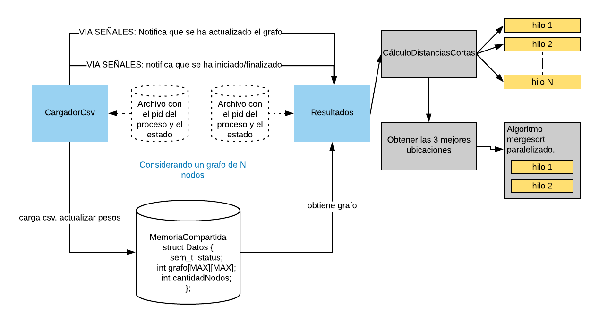
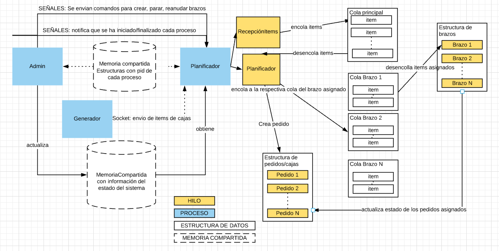

Proyecto de Sistemas operativos
===============================

2019-2S - Primer Parcial
------------------------

# Descripción del proyecto:

    TaxiStation

Los taxistas amarillos de la ciudad XYZ quieren sacar a UBER del mercado pero no tienen el poder político para cambiar las leyes de tránsito. Entonces se les ocurre crear un APP y re-organizar la logística de su flota de taxis. Para atraer más clientes planean que sus taxis lleguen en menor tiempo que los de UBER. Su idea es tener taxis esperando en “sitios estratégicos” de la ciudad cuando no están atendiendo una llamada, el problema es definir esos sitios. Para eso lo contratan a usted y le dan un grafo con las distancias entre intersecciones de la ciudad. Le piden crear un sistema que:\

1) En el menor tiempo posible determinar los 3 mejores puntos de espera. Un punto de espera es aquel que aparece en como parte de la ruta de multiples viajes\

2) Recalcule automaticamente los 3 puntos si hay un cambio en las distancias entre intersecciones o una interseccion deja de estar habilitada por ejemplo por reparaciones en la via.\

Entonces su sistema debe de tener al menos dos componentes: (a) Un programa que cargue el grafo y permita cambiar sus valores y (b) Un programa que calcule y muestre los 3 puntos de espera al inicio y si el grafo cambia. Las acciones de a y b deben realizarse sin tener que reinicar ningun componente de su sistema.\

# Implementación


1. Diagrama.



2. Descripción

Se tiene dos procesos principales(de color celeste).\
1. El primer proceso es CargadorCsv y tiene las siguientes tareas al iniciarse:\

* Actualiza un archivo de nombre “0” con información del proceso: identificador del proceso y estado. Vital para que se pueda comunicar con proceso Resultados.\
* Verificar la cantidad de cores del computador y si es mayor a 1. Setea la afinidad al core 0.\
* Crea la memoria compartida que contendrá la matriz que representa el grafo.\
* Carga un grafo desde un archivo csv a una matriz ubicada en una memoria compartida.\
* Notifica vía señal su inicialización al proceso resultados para que acceda a la memoria compartida.\
* Solicita actualizaciones de pesos.\
* Actualiza la matriz que representa el grafo ubicado en la memoria compartida.\
* Notifica vía señal que se ha actualizado algún peso de algún nodo del grafo.\

2. El segundo proceso es Resultados y tiene las siguientes tareas al iniciarse:\
* Actualiza un archivo de nombre “1” con información del proceso: identificador del proceso y estado. Vital para que se pueda comunicar con proceso cargadorCsv por medio de señales.\
* Verificar la cantidad de cores del computador y si es mayor a 1. Setea la afinidad al core 1.\
* Solicita acceso a la memoria compartida que contendrá la matriz que representa el grafo.\
* Maneja señales para saber si el proceso de cargadorCsv se está ejecutando.\
* Al iniciarse o al recibir una señal que se ha actualizado el grafo se realizará:\
        ** Cálculo de distancias:\
            *** Por cada nodo se creará un hilo para que realice el cálculo de las distancias más cortas desde ese nodo hasta el resto de nodo.\
        ** Obtención de las tres mejores ubicaciones:\
            *** Se obtendrán las frecuencias de cada nodo y se almacenarán en un arreglo.\
            *** Con el algoritmo merge sort multihilo se ordena el arreglo con las frecuencias para saber cuáles son los nodos de mayor frecuencia.\

Para controlar el acceso a la matriz que representa el grafo. En la estructura se tiene un semáforo.\
Con el manejo de señales implementado se puedan ejecutar en cualquier orden y ambos saben cuál ha iniciado o finalizado de forma inmediata, presentando en consola dicha información.\

# Limitaciones de la implementación:
* El tamaño de matriz que se recibe es una constante definida en el archivo Estructuras.h(MAX). Para recibir una matriz que represente un grafo de diferente tamaño a 14(tamaño de matriz permitido actualmente) se debe modificar esa constante y compilar el código otra vez.\
* Actualmente de las señales estándares, solo se está manejando la señal SIGINT(control + C). Pero se pueden incorporar más manejadores para otras señales estándares de forma fácil.\

# Ejecución:

Para compilar:\
```
    cd 1parcial/
    $ make all
```

Existen dos programas que se deben ejecutar en cualquier orden.\
    1. El programa para cargar la matriz\
```
        $ ./ecargadorDatos matrizDistancia.csv
```
        Este mismo programa pregunta si desea ingresar actualizaciones. El formato para ingresar actualizaciones es:\
            nodoinicio-nodofinal-peso\
            Ejemplo: 11-13-1\
    2. El programa para realizar los cálculos y mostrar los resultados\
```
    $ ./eresultados
```

Para eliminar los binarios/archivos creados:\
```
    $make clean
```


2019-2S - Segundo Parcial
------------------------

# Descripción del proyecto:

    Car-Assembly Robotic System

Amazon quiere reemplazar la fuerza de trabajo que tiene para empacar compras hechas a travez de internet.\
La ha pedido que diseñe un sistema que controle un conjunto de N brazos robóticos bajo las siguientes
condiciones: \
(1) Solo se puede llenar una caja si todos los items para esa caja han llegado.\
(2) los items se pueden asignar de dos formas al primer brazo disponible o de forma equitativa para que todos los brazos se
usen por igual.\
(3) Un brazo robot puede parar y reanudar su operación en cualquier momento\
(4) Si hay una para mientras se llena un paquete, los items deben pasar al siguiente brazo robot disponible segun la politica
definida en (2).\
(5) Si no hay brazo robots disponibles los items se deben encolar usando un esquema FIFO y
despacharse tan pronto como se pueda.

# Implementación


1. Diagrama.



2. Descripción

Se tiene tres procesos principales(de color celeste).
1. El primer proceso es ​ planificador​ y tiene las siguientes tareas al iniciarse:
* Validar los parámetros ingresados y define los manejadores de señales.
* Crea las memorias compartidas y las estructuras de datos: cola principal de datos, lista de pedidos.
* Crea un hilo para la recepción de paquetes por socket. Cuando recibe algún
paquete los encola.
* Crea un hilo para la planificación de los paquetes. Desencola de los paquetes, crea un pedido y lo asigna a un brazo robótico de acuerdo al
esquema de prioridad. Luego cada ítem de ese pedido es asignado a la cola específica de cada brazo robótico.
* Crear un hilo para cada brazo robótico que se encarga de desencolar datos y los procesa.

2. El siguiente proceso es admin.
Inicializa los manejadores de señales. Obtiene acceso a las memorias compartidas definidas por el proceso
planificador.\
* Permite el ingreso de comandos que son enviados vía señal al proceso
planificador. Comando como : crear nuevo brazo, suspender , reanudar.
* Obtiene información de la cantidad de pedidos completados, brazos robóticas
activos y suspendidos.

3. El siguiente proceso es generador que se encarga de generar y enviar los ítems de
cada pedidos por socket al proceso planificador.
* Este programa no ha Sido modificado. Excepto su atributo para variar la
velocidad de envío de ítems.

Cada brazo tiene variables de condición para simular su suspensión y reanudación. Cada
brazo tiene a su vez una cola de datos l​ o cual proporciona flexible para manejar varios
pedidos a la vez.\
Cada cola es un implementación de un buffer de tamaño ilimitado con una variable de
condición cuando su tamaño es cero.\
Los esquemas de funcionamiento implementados son los siguientes:
* Primero disponible.- la estructura de brazo Robótico actúa con una lista que se
recorre desde el inicio y se verifica el primer brazo Robótico disponible y que aún no
completa su cuenta máxima de pedidos a tratar. Cuando un brazo completa un
pedido se actualiza su atributo cantidadPedidos.
* Igual cantidad de pedidos.- la estructura sigue actuando como una lista pero ahora
se utiliza una puntero al último elemento de la lista visitado. Lo cual permite asignar
distribuida mente pedidos a cada brazo Robótico.
* Menor cantidad de ítems pendientes .​ - la estructura de datos BrazoRobotica ahora
actual como una cola de prioridad. De Acuerdo a número de ítems pendientes por
los pedidos asociados a un brazo.*

# Limitaciones de la implementación:
*No se implementó para este esquema(​ Menor cantidad de ítems pendientes​ ) la opción de
suspender o reanudar un brazo robótico.\
*Es el esquema(​ Menor cantidad de ítems pendientes​ ) actualmente solo se actualiza la
cola de prioridad al asignar un pedido a un brazo robótico y al finalizar un pedido.
# Ejecución:

Para compilar:

    make all

Existen tres programas que se deben ejecutar en el siguiente orden.
    1. El programa planificador
    
        $ ./eplanificadorBrazosR CANTIDAD-BRAZOS-ROBOTICOS CANTIDAD-MAX-PEDIDOS-POR-BRAZO  ESQUEMA
  
   Donde:\
    CANTIDAD-MAX-PEDIDOS-POR-BRAZO .- Indica cuantos pedidos un brazo robótico puede tener asignado. Debe ser mayor o igual a 1.\
    ESQUEMA(1-3): \
    1  -  ESQUEMA DE PLANIFICACIÓN PRIMERO DISPONIBLE.\
    2  -  ESQUEMA DE PLANIFICACIÓN IGUAL CANTIDAD DE PEDIDOS/CAJAS.\
    3  -  ESQUEMA DE PLANIFICACIÓN MENOR CANTIDAD DE ITEMS PENDIENTES.
    
    EJEMPLO:
        $ ./eplanificadorBrazosR 5 2  1
  s
     2. El programa para actualizar estado de brazos róboticos:
     
        $ ./eadmin
        
  Este mismo programa pregunta si desea ingresar actualizaciones.\
  Primero ingresa el número de la opción . Y Luego el número del brazo.
    
   3. El programa que genera los pedidos/cajas/items.
  
    $ ./eorder_gen

Para eliminar los binarios/archivos creados:

    $ make clean

----------------------------------
### Autor ###
* Mauricio Leiton Lázaro [github](https://github.com/mdleiton)